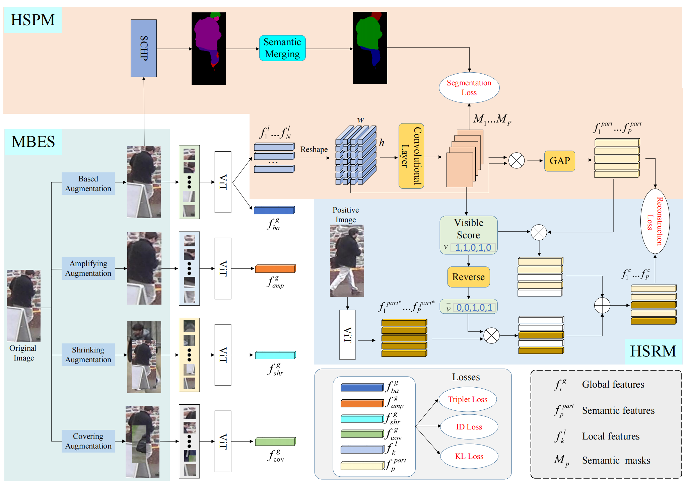

# T-MSPR
Code of paper "Human Semantic Perception and Recovery for Occluded Person Re-Identification"


## Structure of T-MSPR



## Training

We will evaluate the model every few epochs.


```python
# Training on Occluded-Duke
python train.py --config_file configs/OCC_Duke/vit_transreid_stride.yml MODEL.DEVICE_ID "('0')"

# Training on Partial-REID
python train.py --config_file configs/Partial_ReID/vit_transreid_stride.yml MODEL.DEVICE_ID "('0')"

# Training on Occluded-ReID
python train.py --config_file configs/OCC_ReID/vit_transreid_stride.yml MODEL.DEVICE_ID "('0')"

# Training on Market-1501
python train.py --config_file configs/Market/vit_transreid_stride.yml MODEL.DEVICE_ID "('0')"

# Training on DukeMTMC-reID
python train.py --config_file configs/DukeMTMC/vit_transreid_stride.yml MODEL.DEVICE_ID "('0')"


```

## Test

```python
# Test on Occluded-Duke
python test.py --config_file configs/OCC_Duke/vit_transreid_stride.yml MODEL.DEVICE_ID "('0')"

# Test on Partial-REID
python test.py --config_file configs/Partial_ReID/vit_transreid_stride.yml MODEL.DEVICE_ID "('0')"

# Test on Occluded-ReID
python test.py --config_file configs/OCC_ReID/vit_transreid_stride.yml MODEL.DEVICE_ID "('0')"

# Test on Market-1501
python test.py --config_file configs/Market/vit_transreid_stride.yml MODEL.DEVICE_ID "('0')"

# Test on DukeMTMC-reID
python test.py --config_file configs/DukeMTMC/vit_transreid_stride.yml MODEL.DEVICE_ID "('0')"


