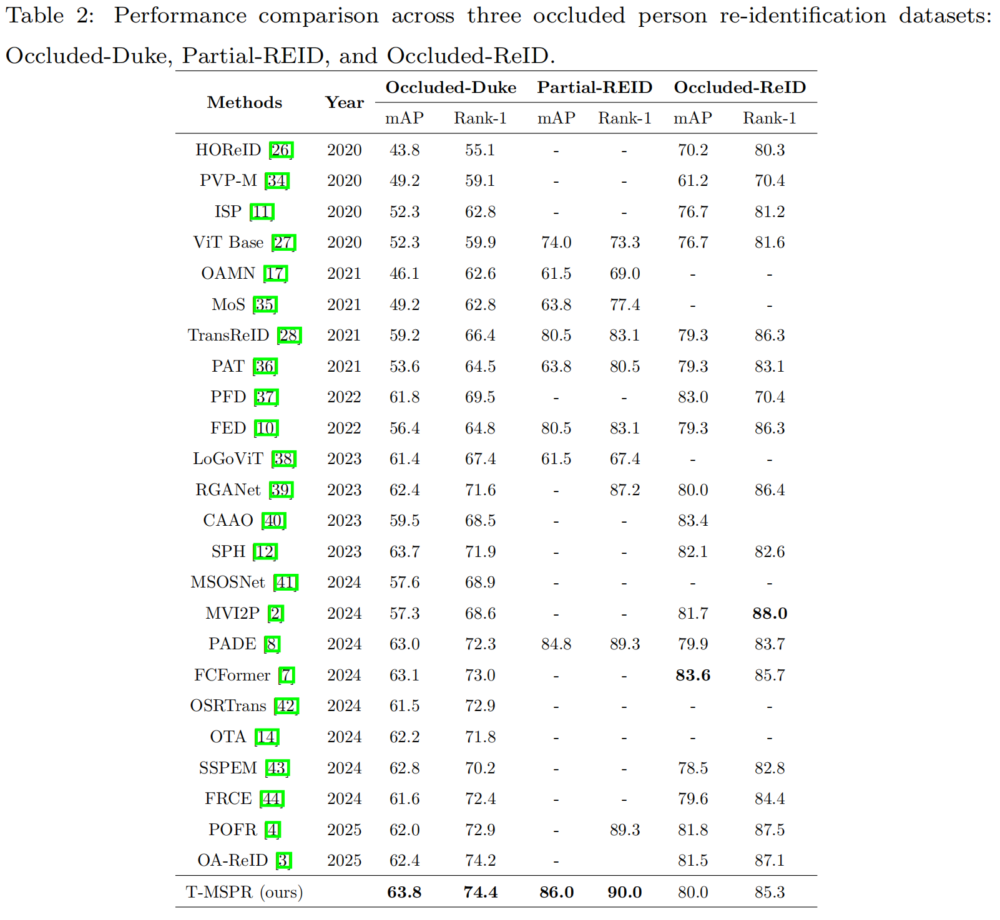

# T-MSPR
Code of paper "Human Semantic Perception and Recovery for Occluded Person Re-Identification"

## model download link
Download link :https://www.flyai.com/m/jx_vit_base_p16_224-80ecf9dd.pth


## Structure of T-MSPR


## Results



## Visualization

We visualized some of the ranking list results (rank-10) on the Occluded-Duke dataset. The above is the result of the baseline, and below is our method.


## Training

We will evaluate the model every few epochs.


```python
# Training on Occluded-Duke
python train.py --config_file configs/OCC_Duke/vit_transreid_stride.yml MODEL.DEVICE_ID "('0')"

# Training on Partial-REID
python train.py --config_file configs/Partial_ReID/vit_transreid_stride.yml MODEL.DEVICE_ID "('0')"

# Training on Occluded-ReID
python train.py --config_file configs/OCC_ReID/vit_transreid_stride.yml MODEL.DEVICE_ID "('0')"

# Training on Market-1501
python train.py --config_file configs/Market/vit_transreid_stride.yml MODEL.DEVICE_ID "('0')"

# Training on DukeMTMC-reID
python train.py --config_file configs/DukeMTMC/vit_transreid_stride.yml MODEL.DEVICE_ID "('0')"


```

## Test

# Test on Occluded-Duke
python test.py --config_file configs/OCC_Duke/vit_transreid_stride.yml MODEL.DEVICE_ID "('0')"

# Test on Partial-REID
python test.py --config_file configs/Partial_ReID/vit_transreid_stride.yml MODEL.DEVICE_ID "('0')"

# Test on Occluded-ReID
python test.py --config_file configs/OCC_ReID/vit_transreid_stride.yml MODEL.DEVICE_ID "('0')"

# Test on Market-1501
python test.py --config_file configs/Market/vit_transreid_stride.yml MODEL.DEVICE_ID "('0')"

# Test on DukeMTMC-reID
python test.py --config_file configs/DukeMTMC/vit_transreid_stride.yml MODEL.DEVICE_ID "('0')"

## Dataset Comparison

We demonstrate the training and test data imbalance problem of occluded ReID by displaying samples in the training set and test set. Note: Pick one image for each ID as a representative.

Training data (Market 1501): only a few IDs are obscured


Testing data (Partial-REID): query (left, 100% occluded), gallery (right, ~ 100% non-occluded)
<div style="display: flex; justify-content: center; align-items: center;">
    
    

Testing data (Occluded-REID): query (left, 100% occluded), gallery (right, ~ 100% non-occluded)
<div style="display: flex; justify-content: center; align-items: center;">
    
    


